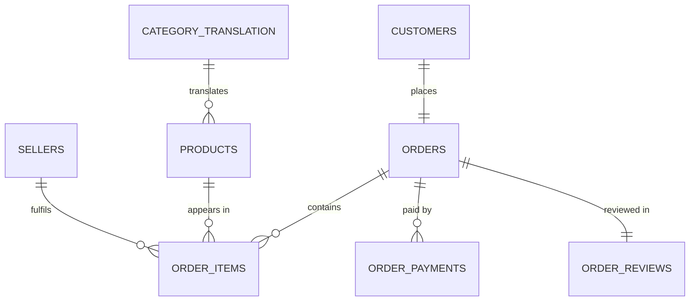
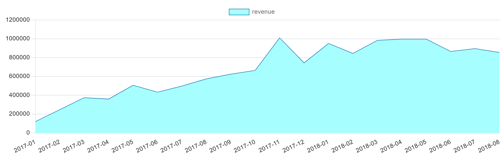
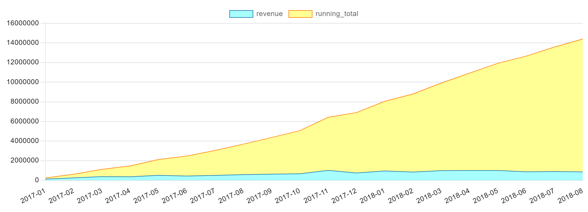
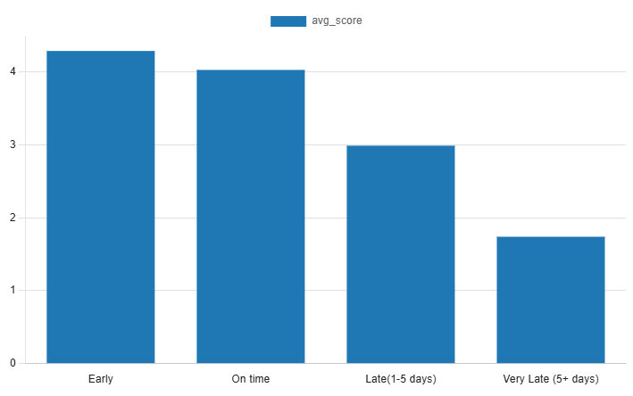

# Olist Analytics

An end-to-end SQL analytics project on the [Brazilian E-Commerce Public Dataset by Olist](https://www.kaggle.com/datasets/olistbr/brazilian-ecommerce): 9 raw CSVs are profiled in pandas, loaded into PostgreSQL as text-only staging tables, transformed into constrained relational tables, and then queried for a variety of purposes such as revenue, geography, categories, payments, customer cohorts, and delivery time vs review score.

This project isn't simply SQL queries. Every modelling decision (what the primary key should be, whether a table should be dropped or not) is documented in [`notes.md`](notes.md), and all the analysis of the SQL queries can be found in [`analysing_queries.md`](analysing_queries.md). Finally, in the folder named [`graphs`](graphs) there is a variety of visual representations of the query results.

## Stack

- **PostgreSQL 18** 
- **Python 3.14** — the pipeline scripts
  - **pandas 3.0.5** — profiling the raw CSVs in the exploration phase
  - **psycopg 3.3.5** — database driver, used for the `COPY` load and the upserts
  - **python-dotenv 1.2.3** — keeps credentials in `.env` and out of the code
- Plain `.sql` files for the schema and the analysis.

## Repository layout

```
src/
  config.py                  Reads Postgres credentials from .env, fails loudly if any are missing
  check_connection.py        Smoke test: prints server version, database, user
  explore_orders.py          Phase 1 — profiling of the orders CSV
  explore_relationships.py   Phase 2 — row counts, distinct counts, nulls, PK/FK discovery across all 9 CSVs
  loading_stg.py             Truncates and COPYs every CSV into its stg_table
  transform.py               Staging -> modelled tables, idempotent (ON CONFLICT upserts)

sql/
  01_staging.sql             stg_tables, every column TEXT (staging mirrors the source, warts included)
  02_schema.sql              Modelled tables with PKs, FKs and CHECK constraints
  schema_exploration.sql     Per-column type investigation that justifies each type in 02_schema.sql
  transform.sql              The SQL from transform.py, kept readable as standalone statements
  test_for_pipeline.sql      Post-load row-count checks

queries/                     The 10 analysis queries, numbered in the order they were written
graphs/                      Charts exported from the query results
notes.md                     Data profiling findings, the ER diagram, and every modelling decision
analysing_queries.md         Findings per query, plus the EXPLAIN before/after for the index work
```
## Setup

**1. Database and credentials**

```bash
createdb olist_data
cp .env.example .env     # then fill in PGPASSWORD
```

`.env` holds `PGHOST`, `PGPORT`, `PGDATABASE`, `PGUSER`, `PGPASSWORD`. It is gitignored.

**2. Python environment**

```bash
python -m venv .venv
source .venv/bin/activate        # Windows: .venv\Scripts\activate
pip install -r requirements.txt
```

**3. Data**

Download the dataset from Kaggle and unzip the nine CSVs into `data/` at the repo root (gitignored — the CSVs are not committed):

```
data/
  olist_customers_dataset.csv
  olist_orders_dataset.csv
  olist_order_items_dataset.csv
  olist_order_payments_dataset.csv
  olist_order_reviews_dataset.csv
  olist_products_dataset.csv
  olist_sellers_dataset.csv
  olist_geolocation_dataset.csv
  product_category_name_translation.csv
```

## Running the pipeline

```bash
cd src
python check_connection.py          # verify the connection first

psql -d olist_data -f ../sql/01_staging.sql    # create stg_ tables
python loading_stg.py                          # COPY the CSVs in, prints row counts

psql -d olist_data -f ../sql/02_schema.sql     # create the modelled tables
python transform.py                            # staging -> model, prints rows affected
```

Then run anything in `queries/` against the database.

`loading_stg.py` truncates before loading and `transform.py` upserts on the primary key, so the whole pipeline can be re-run from scratch at any point without duplicating rows.


## Data model

Two layers:

- **Staging (`stg_*`)** — one table per CSV, every column `TEXT`. Nothing is cleaned, nothing is rejected, the source typo `lenght` is preserved. Staging is a faithful copy of the extract, so anything dropped downstream can still be recovered.
- **Modelled** — typed columns, primary keys, foreign keys and check constraints. This is what the analysis queries read.




| Table | Rows | Primary key |
|---|---|---|
| `customers` | 99,441 | `customer_id` |
| `orders` | 99,441 | `order_id` |
| `order_items` | 112,650 | `(order_id, order_item_id)` |
| `order_payments` | 103,886 | `(order_id, payment_sequential)` |
| `order_reviews` | 98,673 | `order_id` (after dedup) |
| `products` | 32,951 | `product_id` |
| `sellers` | 3,095 | `seller_id` |
| `categories_translations` | 73 | `product_category_name` |

Money is `NUMERIC(10,2)` everywhere — never floating point.

### Important Modelling Decisions

Full analysis can be found in [`notes.md`](notes.md)

- **`customer_id` is per order, `customer_unique_id` is a uniques identifier for every customer. (99,441 vs 96,096). Any repeat purchase by a single customer has to group by `customer_unique_id`.

- **Reviews have no usable primary key in the source.** `review_id` is reused across 789 rows, and 547 orders carry more than one review. The modelled table deduplicates to the latest review per order, which *creates* `order_id` as a real primary key — it is not one in the raw data. `review_id` is kept as a plain column for traceability only; it can't constrain anything.

- ** `geolocation` is excluded entirely, has no working Primaty Key, and `53 rows per zip prefix, so joining would 53x the tables.

- **`payment_type` = `not defined` becomes `NULL` (3 rows all worth R$0.00). It is missing data writtend as a category; keeping it will create a 5th phantom category in payments.

- **Two missing category translations are added during transform** (`pc_gamer`, `portateis_cozinha_e_preparadores_de_alimentos`) — they exist in `products` but not in the translation table, and the FK would reject those rows otherwise.

- **Analysis window: `>= 2017-01-01` and `< 2018-09-01`** — 20 complete months. 2016 is incomplete (November has 0 rows) and the extract was cut mid-stream in September 2018.

## Analysis

Ten queries in `queries/`, findings in [`analysing_queries.md`](analysing_queries.md). Revenue means `SUM(order_items.price)` — freight is excluded.

| # | Query | What it answers |
|---|---|---|
| 01 | `revenue_by_month.sql` | Monthly revenue trend |
| 02 | `orders_by_state.sql` | Revenue and order count per state |
| 03 | `top_performing_categories.sql` | Revenue per product category |
| 04 | `average_order_value.sql` | AOV by order status |
| 05 | `analyzing_payment_types.sql` | Volume, value and installments per payment method |
| 06 | `revenue_by_month_running_total.sql` | Cumulative revenue (window function) |
| 07 | `month_over_month.sql` | Absolute and % change (`LAG`) |
| 08 | `first_order_per_customer.sql` | First-order date and value per customer (`ROW_NUMBER`) |
| 09 | `customer_cohorts.sql` | Monthly cohort retention |
| 10 | `late_delivery_reviews.sql` | Review score bucketed by delivery lateness |

### Key Findings

**1. Revenue by Month** — Revenue is on an upward trajectory, growing 7.1x from R$120,313 in January 2017 to R$854,686 in August 2018. The top selling month is `November 2017` with R$1,010,271.37, the likely explanation being `Black Friday`.



**2. Orders by State** — `SP` São Paulo alone accounts for `38.31%` of total revenue, against roughly 22% of Brazil's population. The three highest states make up `63.36%`, while the last 10 combined make up only `3.42%`.


**3. Top Performing Categories** — No single category dominates like `SP` does in geography, the top selling `health_and_beauty` accounts for only `9.2%` and the top 5 for `39.78%`. `unknown` ranks 21st with R$179,469, kept visible via `LEFT JOIN` + `COALESCE` where an inner join would have silently deleted it.

**4. Average Order Value by Status** — AOV is R$137.00, but `cancelled` orders have the highest value at R$205.76, roughly double `shipped`. That is 448 orders and ~R$92K lost, though the cause cannot be determined from this data.

**5. Payment Types** — Credit card is `73.9%` of transactions but `79%` of total value, because its average ticket is larger at R$163.24. Instalments are exclusively a credit card feature, every other method sits at exactly 1.00, which is structurally correct for Brazil and validates the data.

**6. Revenue Running Total** — The running total confirms the upward trajectory. More than half of the R$13,541,712.78 was earned after December 2017, meaning the majority landed in the last 8 months of the 20 month window.



**7. Month over Month Change** — The `Black Friday` spike is evident with a `52.1%` increase from October to November 2017, followed by a `-26.4%` drop in December. From April to August 2018 revenue plateaus (1.4%, 0.0%, -13.2%, 3.5%, -4.6%) where 2017 varied substantially.

**8. First Order per Customer** — 95,121 customers placed their first order inside the window, averaging R$138.15. Compared to the AOV of R$137.00 that is a 0.8% difference, practically identical.

**9. Customer Cohorts** — Retention is close to zero, every cohort at every month offset sits between `0.06%` and `0.78%`. The shape matters more than the size, there is no decay curve, so these are not returning customers but one-off repeat purchases. Olist is a marketplace, not a store, which explains it.

**10. Late Delivery and Low Reviews** — Review score falls consistently as delivery gets later: 4.29 early, 4.03 on time, 2.99 late 1-5 days, 1.74 very late, a 2.55 point spread on a 5 point scale. `On time` scoring below `Early` means meeting the promise is not as good as beating it.



**11. Analyze and Indexing** — The month filter on `orders` was a sequential scan removing 92,172 rows at 12.36 ms. After adding `idx_orders_purchase_timestamp` it became an index only scan at 0.52 ms, a ~24x improvement with buffers dropping from 5,424 to 22.